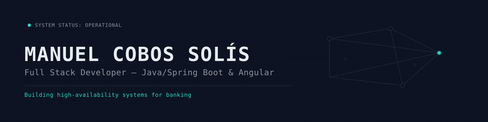

  

 

  
  
  

 

# Manuel Cobos Solís

**Full Stack Developer | Java Backend | Spring Boot | Angular | Microservices | Banking**

## About Me

I'm a **Full Stack Developer** with more than 2 years of professional experience in software development for the **banking sector**, with a strong focus on **Java backend development, Spring Boot, microservices and distributed systems**.

I build and maintain production software using **Java 17, Java 21, Spring Boot, REST APIs, Apache Kafka, RabbitMQ and Spring WebClient**, applying **Clean Architecture, Domain-Driven Design (DDD), API-first design and Event-Driven Architecture**.

On the frontend, I work with **Angular 18 and Angular 20, TypeScript, RxJS, Vitest and Karma**, building production applications and integrating them with backend services.

I also work across **CI/CD, containers, infrastructure and software security**, using **Docker, Kubernetes, OpenShift, GitHub Actions, Maven, SonarQube, Fortify, Trivy and HashiCorp Vault**.

My professional experience includes **high-availability banking systems, production incident resolution, legacy code refactoring, automated testing and release management using Scrum and Jira**.

I enjoy building software that is reliable, maintainable, secure and ready for production.

Based in **Cáceres, Spain**, and open to remote opportunities in **banking, fintech, backend Java, full stack development and distributed systems**.

## Technical Skills

### Backend

**Java 17, Java 21, Spring Boot, Spring Security, Spring Data JPA, Spring MVC, Spring WebClient, REST APIs, Microservices, Clean Architecture, Domain-Driven Design (DDD), API-first design, concurrent processing, batch jobs, inter-service communication and timeout management.**

### Frontend

**Angular 18, Angular 20, TypeScript, RxJS, Vitest, Karma.**

### Messaging and Distributed Systems

**Apache Kafka, RabbitMQ, WebSockets, Event-Driven Architecture (EDA), asynchronous messaging, consumer groups, offset management and retry policies.**

### DevOps and CI/CD

**Docker, Kubernetes, OpenShift, GitHub Actions, Maven, Git, GitHub, Continuous Integration and Continuous Delivery.**

### Security and Code Quality

**SonarQube, Fortify, Trivy, HashiCorp Vault, static code analysis, vulnerability analysis, secrets management and secure software development.**

### Databases and Persistence

**PostgreSQL, Spring Data JPA, MongoDB, Redis, Oracle, MySQL and Firebase.**

### Integration

**MuleSoft Anypoint Platform, Anypoint Exchange and IBM Integration Bus (IIB).**

### Testing

**JUnit 5, Mockito, unit testing, integration testing and code coverage above 90%.**

### Methodologies

**Scrum, Agile, Jira and release management.**

### AI-Assisted Development

**AI-assisted software development, code generation, code refactoring and development task automation.**

## Professional Experience

### Full Stack Developer - ViewNext

**Banking Sector | Jul 2025 - Present**

* Develop and maintain production **Angular** applications and backend services using **Java and Spring Boot**.
* Designed and implemented a **microservice orchestrator** that receives a single JSON request and dynamically routes payload sections to specialized microservices using **Apache Kafka, RabbitMQ and Spring WebClient**.
* Developed a generic **dynamic database connectivity microservice** using runtime bean creation and persistent connections.
* Managed database credentials using **HashiCorp Vault**.
* Developed complete **Full Stack microservices** using **Java, Spring Boot and Angular**, defining REST API contracts and endpoint naming standards.
* Participated in architecture definition, API contracts and web design together with the technical lead.
* Identified and fixed security vulnerabilities through **SonarQube and Fortify** analysis in production banking environments.
* Resolved production incidents in **high-availability systems**.
* Refactored legacy code and increased unit and integration test coverage to **more than 90%**.
* Supported onboarding and technical training for new developers and interns.
* Managed releases using **Scrum and Jira**, from development through production deployment on **OpenShift**.

### Backend Developer - ViewNext

**Banking Sector | FCT Internship | Nov 2024 - Jun 2025**

* Implemented asynchronous messaging systems with **Apache Kafka and RabbitMQ**, including consumer groups, offset management and retry policies.
* Developed **REST APIs** using **Spring MVC, Spring Data JPA and PostgreSQL**.
* Applied **Domain-Driven Design (DDD)** and **Clean Architecture** to backend services.
* Developed unit and integration tests using **JUnit 5 and Mockito**.
* Contributed to backend services running in banking production environments.

### Integration Developer - ViewNext

**Enterprise Integration | FCT Internship | Mar 2024 - Jun 2024**

* Designed integration flows using **MuleSoft Anypoint Platform**.
* Published and managed APIs through **Anypoint Exchange**.
* Implemented data transformations and message routing using **IBM Integration Bus (IIB)**.

## Certifications

* **1Z0-811 Java Certified Foundations Associate - Oracle | 2026**
* **MuleSoft Certified Developer I - Salesforce | 2024**
* **LPIC-1 - Linux Professional Institute Certification | 2023**
* **B2 Business English - goFLUENT | 2026**
* **Cambridge B1 Preliminary - University of Cambridge ESOL | 2026**

## Education

**Higher Technician in Web Application Development (DAW)**
IES Ágora | 2024 - 2025

**Higher Technician in Multiplatform Application Development (DAM)**
IES Ágora | 2022 - 2024

## Languages

**Spanish:** Native
**English:** B2

## What I Work On

I'm particularly interested in:

* **Java backend development**
* **Spring Boot and microservices**
* **Distributed systems and asynchronous messaging**
* **Apache Kafka and RabbitMQ**
* **REST API design**
* **Angular and Full Stack development**
* **CI/CD and cloud-native infrastructure**
* **Software security and code quality**
* **High-availability systems**
* **Banking and fintech technology**
* **AI-assisted software development**

## Connect

I'm open to opportunities in **banking, fintech, Java backend, Full Stack development, microservices and distributed systems**.

         

 

  

